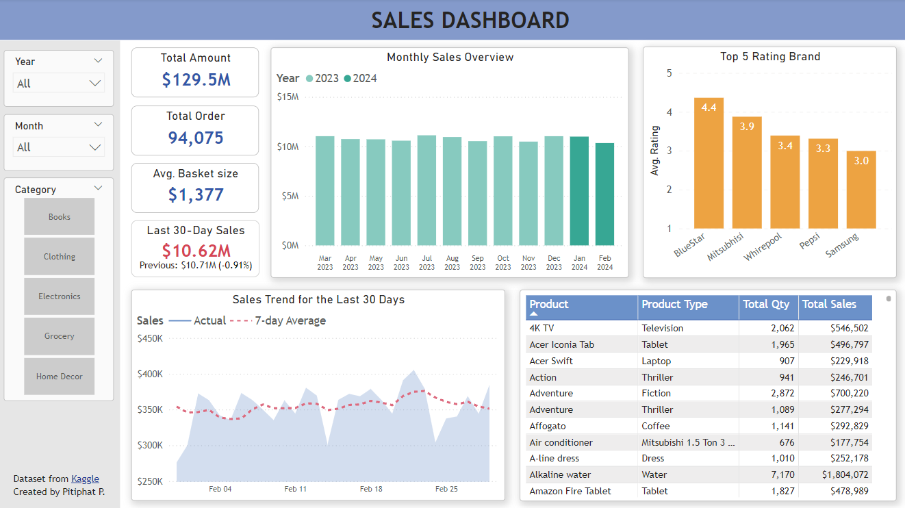
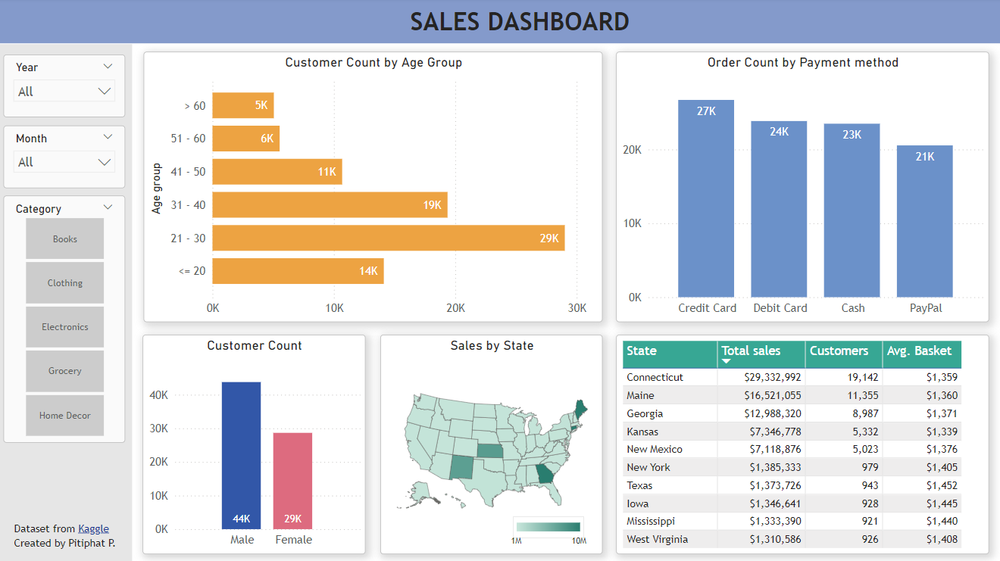

## Sales Dashboard

### Data source
The data used in this dashboard comes from a retail transaction dataset available on [Kaggle](https://www.kaggle.com/datasets/bhavikjikadara/retail-transactional-dataset/data). The dataset contains transaction data for various products across five categories: books, clothing, electronics, grocery, and home decoration. It covers transactions in the United States from March 2023 to February 2024, providing a rich source of information for analysis.

### Dashboard Structure
The dashboard consists of two sections:  
**Overview:** Provides an overview of Sales, Order, Trending in last 30 days, top rating brand  
**Customer:** Customer demographics and preferred payment methods

For a more interactive experience, check out the full dashboard here: [Link](https://app.powerbi.com/view?r=eyJrIjoiNmUzZjk3ODktNjI0My00ZTM1LTgxNjYtZGYwMDBlMDU0OWRjIiwidCI6IjI3MWQ1ZTdiLTEzNTAtNGI5Ni1hYjg0LTUyZGJkYTRjZjQwYyIsImMiOjEwfQ%3D%3D)

### Visualizations
Below are visualizations included in the dashboard:

<!--  -->
<!-- Using HTML to resize the image -->

  
  
Overview page

 

<!--  -->

  
  
Customer page

 

