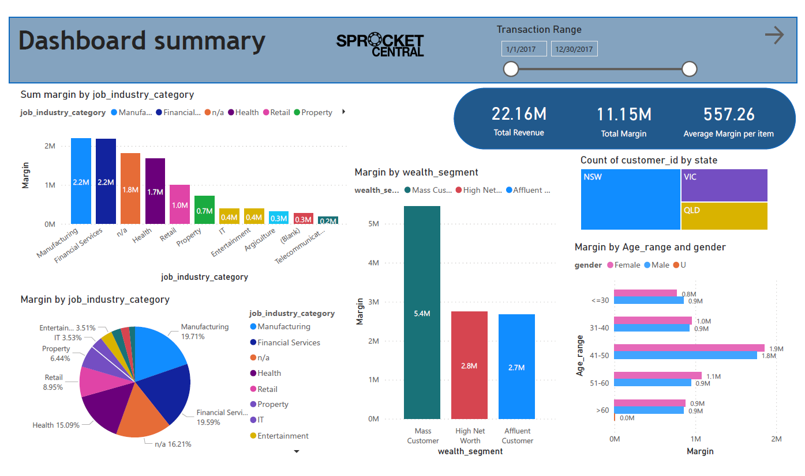

# Sprocket Central Pty Lt

This project is a part of [KPMG AU Virtual Internship](https://www.theforage.com/virtual-internships/theme/m7W4GMqeT3bh9Nb2c/KPMG-Data-Analytics-Virtual-Internship) which is designed to build practical skills and experience.

## Background
Sprocket Central Pty Ltd, a medium size bikes & cycling accessories organisation, has a large dataset relating to its customers, but their team is unsure how to effectively analyse it to help optimize its marketing strategy. They want to target high value customers bases on customer demographics.

## Analysis phase
1. Data Preparation
2. Data Insight
3. Dashboard

### 1. Data Preparation
Review the data quality, examine issues and recommend any concerns then draft email to inform customer

### 2. Data Insight
Transform and analyze 3 datasets; Customer demographic, Customer address, Transactions, to find trends and target potential customers

### 3. Dashboard
Create dashboard to present insight (page 1), and list potential customers (page 2)

