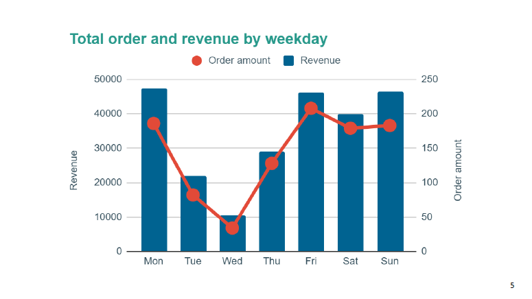
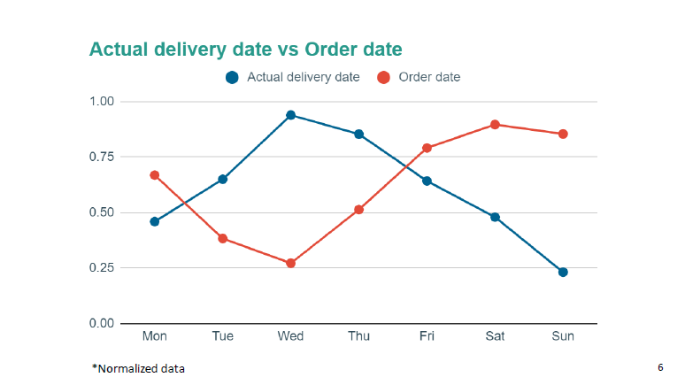

## Shipping Company Analysis

This project focuses on analyzing shipping company data using **Google Sheets**. The objective is to gain insights in the company's shipping operations. To find my original file in Google sheets, click [here](https://docs.google.com/spreadsheets/d/1nhKVdkh-YeeLUoWVZW5bC89CmKP0gwae7QP-vcz3uAs/edit?usp=sharing)

Thanks to [SkillKamp](https://www.skillkamp.com/) for advice and opportunity to  demonstrate analysis skills.

### Data
The data used for this project related to the shipping company's operations between [4/01/2014 - 30/12/2017]:

- Row ID
- Order date
- Delivered date
- Ship mode
- Customer information
- Branch location
- Shipment category
- Revenue
- Shipped item quantity

### Data cleaning
1. Duplicate `source sheet` so it will be unchangeable.  
2. Apply filter, skim columns to check null or blank value.  
3. Create new sheet which contain unique in each column to verify misspelling.  
4. Apply trim whitespace and remove duplicate.  

### Data transform
1. Change column name for more understandable  
2. Transform date format to [dd/mm/yyyy] and extract weekday to new column  
3. Add new columns; delivery time  

### Data analysis
Find insight and create visualization from tasks below:  
1. Descriptive statistic  
2. Choropleth map of shipping quantity in each state  
3. Shipping order in each category  
4. Ship mode for each category  
5. Delivery time in each category  
6. Change of shipping order in each year and region  
7. Additional insights  

### Insights
1. Both revenue and order have the lowest amount in Wednesday and higher in weekend.

2. Customers use the shipping service mostly in weekend and shipping items have arrived the destination mostly in Wednesday. 

### Dashboard and presentation
See dashboard and 5-min pitching presentation in `/result`

